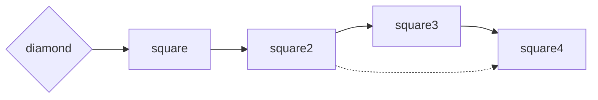
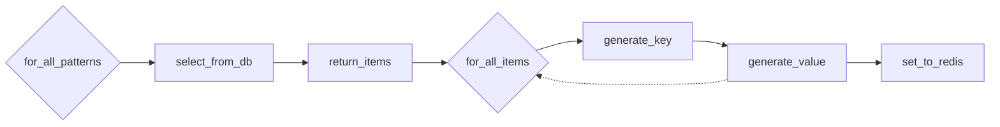

# configs
Configs on Unix at work

Testing mermaid

```mermaid
graph LR
   diamond{diamond}-->square
   square-->square2
   square2-->square3
   square3-->square4
   square2-.->square4
```

```mermaid
graph LR
   for_all_patterns{for_all_patterns}-->select_from_db
   select_from_db-->return_items
   return_items-->for_all_items{for_all_items}
   for_all_items-->generate_key
   generate_key-->generate_value
   generate_value-.->for_all_items
   generate_value-->set_to_redis
```
